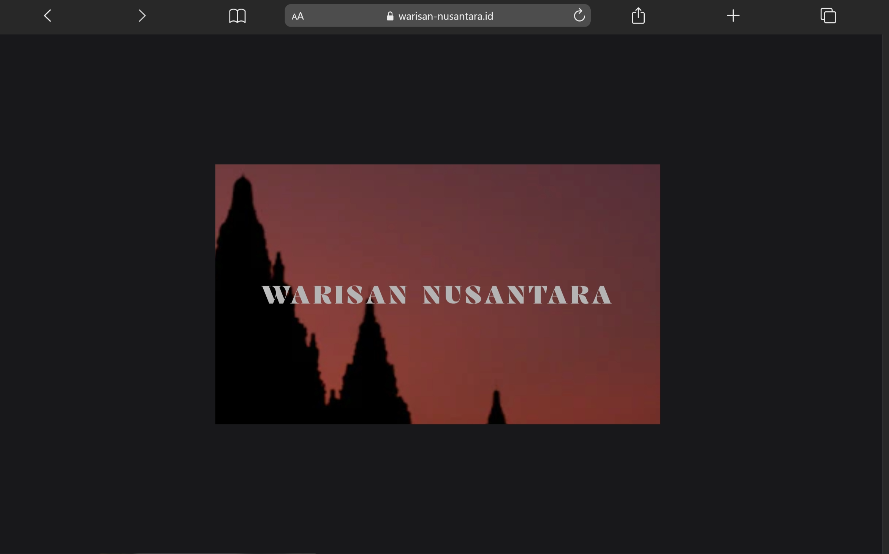
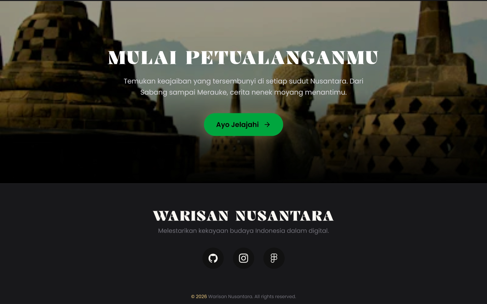
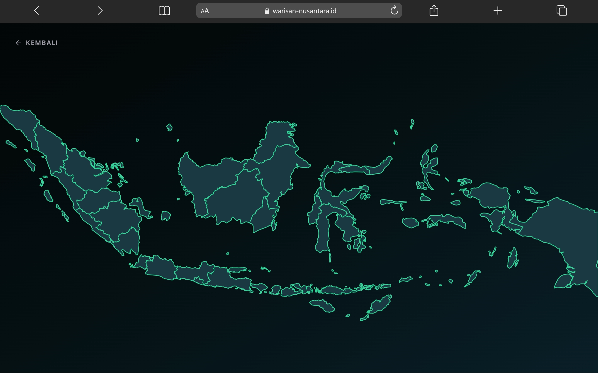
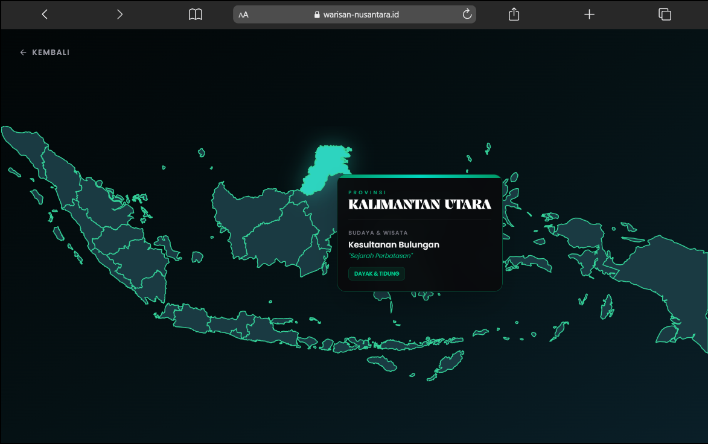
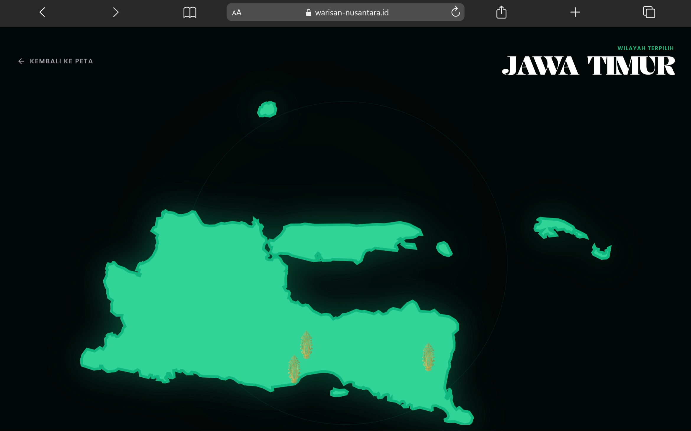
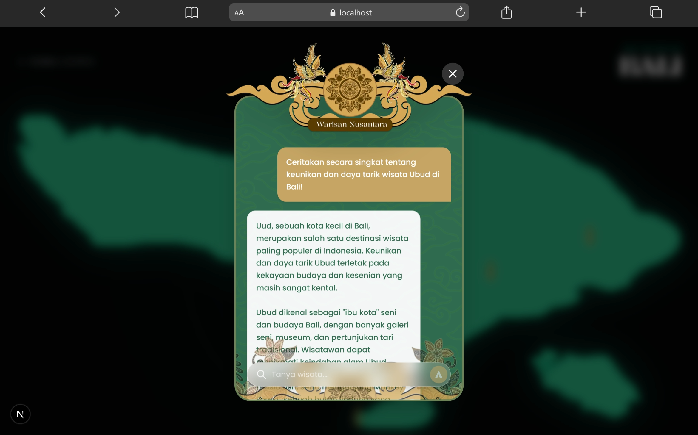

# Warisan Nusantara

**Warisan Nusantara** adalah platform web interaktif yang dirancang untuk memperkenalkan dan mempromosikan kekayaan budaya serta destinasi wisata Indonesia kepada dunia. Melalui antarmuka yang modern dan imersif, pengguna dapat menjelajahi keindahan nusantara dari sabang sampai merauke.

## 🌟 Fitur Utama

- **Peta Interaktif Nusantara**: Eksplorasi visual berbasis peta SVG interaktif yang detail, mencakup pulau-pulau besar dan provinsi di Indonesia.
- **Informasi Budaya & Wisata**: Halaman detail untuk setiap provinsi yang menyajikan informasi tentang destinasi wisata unggulan, kekayaan budaya, dan tagline unik daerah.
- **Asisten Virtual AI**: Fitur chat cerdas yang terintegrasi dengan **Groq Cloud** menggunakan model **Llama 3.3 70B Versatile** untuk menjawab pertanyaan pengguna seputar pariwisata, budaya, dan sejarah Indonesia secara real-time dengan performa tinggi.
- **Visual Imersif**: Dibangun dengan desain modern menggunakan efek _glassmorphism_, animasi halus (_Framer Motion_), dan tema gelap yang elegan.

## 🛠️ Teknologi

Proyek ini dibangun menggunakan teknologi web modern:

- **Framework**: [Next.js](https://nextjs.org/) (App Router)
- **Bahasa**: [TypeScript](https://www.typescriptlang.org/)
- **Styling**: [Tailwind CSS](https://tailwindcss.com/)
- **Animasi**: [Framer Motion](https://www.framer.com/motion/)
- **Icons**: React Icons
- **AI Integration**: [Groq Cloud SDK](https://groq.com/) (Llama 3.3 70B Versatile)

## 📸 Dokumentasi & Antarmuka

Berikut adalah tampilan visual dari platform **Warisan Nusantara**:

### 1. Landing Page (Hero Section)

_Tampilan utama yang menyambut pengguna dengan nuansa budaya Indonesia yang elegan._

### 2. Mulai Eksplorasi

_Halaman transisi untuk memulai perjalanan menjelajahi nusantara._

### 3. Peta Interaktif (Pilih Pulau)

_Peta Indonesia interaktif yang memungkinkan pengguna memilih pulau besar untuk dieksplorasi lebih lanjut._

### 4. Interaksi Peta (Hover)

_Efek visual saat pengguna berinteraksi dengan peta, memberikan pengalaman yang responsif._

### 5. Detail Provinsi

_Informasi lengkap mengenai provinsi, mulai dari destinasi wisata hingga warisan budaya._

### 6. Asisten Virtual AI

_Fitur chat cerdas berbasis AI untuk memandu pengguna mendapatkan informasi tambahan secara instan._
